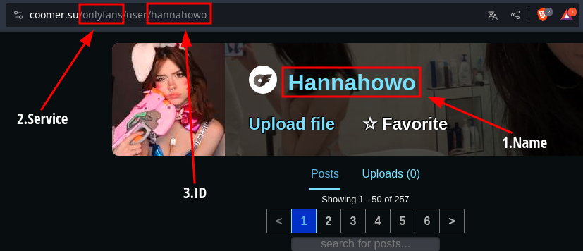

# Coomer-Update-Checker
A tool to check new updates from your favorite Coomer content creators.

## Table of contents
- [Requirements](#requirements)
- [How to use](#how-to-use)
- [Notes](#notes)

## Requirements
- Python 3.10+
- Discord_Webhook (Optional)

## How to use
1. Download the `coomer-checker` source:

    ```console
    user@host:~$ git clone https://github.com/Bakalhau/coomer-Update-Checker/tree/coomer coomer_checker
    user@host:~$ cd coomer_checker
    ```
2. Configure the application:

    ```console
    user@host:coomer_checker$ mv .env.example .env
    user@host:coomer_checker$ nano .env
    ```

    Change the values of the variables in `.env` as needed.
    Read the comments to guide you. Note that `.env` should be in the root
    directory of this repository.

    **How get Discord Webhook Url**
    

3. Configure your creators on `creators.csv`:

    ```csv
    name,service,id
    NAME OF CREATOR,TYPE OF SERVICE (Onlyfans/Fansly), ID FROM CREATOR (Get on URL ADRESS)
    ```

    **How get Name, Type and ID**
    

4. Run it!

    It will only save all the creator's posts to check if there is anything new in the next run
    ```console
    user@host:coomer_checker$ python3 main.py
    ```

    Now, if you run it, and you have something new from the creator, it should show something like this:
    ```console
    user@host:coomer_checker$ python3 main.py
    # New: 🏕🍃🌹,2023-04-24 21:26:28,https://coomer.party/onlyfans/user/belledelphine/post/579418021,https://img.coomer.su/thumbnail/data/32/7f/327ff5017cdcaae1a33e0dc06aa4eb7a7954af19c5ec912128fa0c71282dfdcc.jpg
    ```
    If you want to test if it's working, you can delete some posts from the cache, in the folder `logs/nameofcreator_service.csv`:
    ```csv
    title,date,url,image
    Where do you wanna eat it fr..",2022-11-14 11:29:41,https://coomer.party/onlyfans/user/obokozu/post/450911374,https://img.coomer.su/thumbnail/data/68/d9/68d93170e128295fa0b8fe47ccbe9b918783e99833a87f2140c498c0d704e6ce.jpg
    One my favorite shirt 😆💙,2022-11-13 12:49:03,https://coomer.party/onlyfans/user/obokozu/post/450269365,https://img.coomer.su/thumbnail/data/8f/61/8f6105687512f2342bf9ca591303ee30cddfe3380805bac2b9dc16c8f08d83f1.jpg
    ```

    ```console
    user@host:coomer_checker$ python3 main.py
    # New: Where do you wanna eat it fr..",2022-11-14 11:29:41,https://coomer.party/onlyfans/user/obokozu/post/450911374,https://img.coomer.su/thumbnail/data/68/d9/68d93170e128295fa0b8fe47ccbe9b918783e99833a87f2140c498c0d704e6ce.jpg
    # New: One my favorite shirt 😆💙,2022-11-13 12:49:03,https://coomer.party/onlyfans/user/obokozu/post/450269365,https://img.coomer.su/thumbnail/data/8f/61/8f6105687512f2342bf9ca591303ee30cddfe3380805bac2b9dc16c8f08d83f1.jpg
    ```
    **Example of embed in discord**
    
    

5. Running it continuously

    Like an update checker, you want it to constantly check for something new, so we need it to run from time to time.

    ## On Linux:
    We have some options here in linux:
    - Crontab
    - Anacron
    - Systemd (Recommended)

    As in my tests it is the easiest and most reliable option, I will show you how to do it in **systemd**:

    First we create a `.service` file in `/etc/systemd/system/`:
    ```console
    user@host:coomer_checker$ sudo nano /etc/systemd/system/coomer_checker.service
    ```

    We need to create a service to run the file, there are many ways to do this, but let's do it simply
    ```console
    # GNU nano 7.2           /etc/systemd/system/coomer_checker.service
    [Unit]
    Description=Coomer Party Update Checker

    [Service]
    Type=oneshot
    WorkingDirectory=/home/user/coomer_checker
    ExecStart=/usr/bin/python3 /home/user/coomer_checker/main.py
    ```

    Now we need to create a timer to run the service from time to time, we can do this with:
    ```console
    user@host:coomer_checker$ sudo nano /etc/systemd/system/coomer_checker.timer
    ```

    Here you can choose the time between each execution [**BE CAREFUL** not to set a time shorter than 10 minutes, you might end up being blocked by coomer's anti-DDOS]
    ```console
    # GNU nano 7.2           /etc/systemd/system/coomer_checker.timer
    [Unit]
    Description=coomer Timer

    [Timer]
    OnUnitActiveSec=1800s
    OnBootSec=1800s

    [Install]
    WantedBy=timers.target
    ```

    Let's enable and start the service:
    ```console
    user@host:coomer_checker$ sudo systemctl enable coomer_checker.timer
    user@host:coomer_checker$ sudo systemctl start coomer_checker.timer
    ```

    Good job! Now everything is configured, and every X minutes the service should run, even if you restart your computer.

    ## On Windows:

    Well, I'm not a Windows user, so I don't know how to do it, but I believe there are several ways. I'm sure you can do it, I trust your potential!

    

## Notes

### It also works for Kemono.party, check out the Kemono branch!